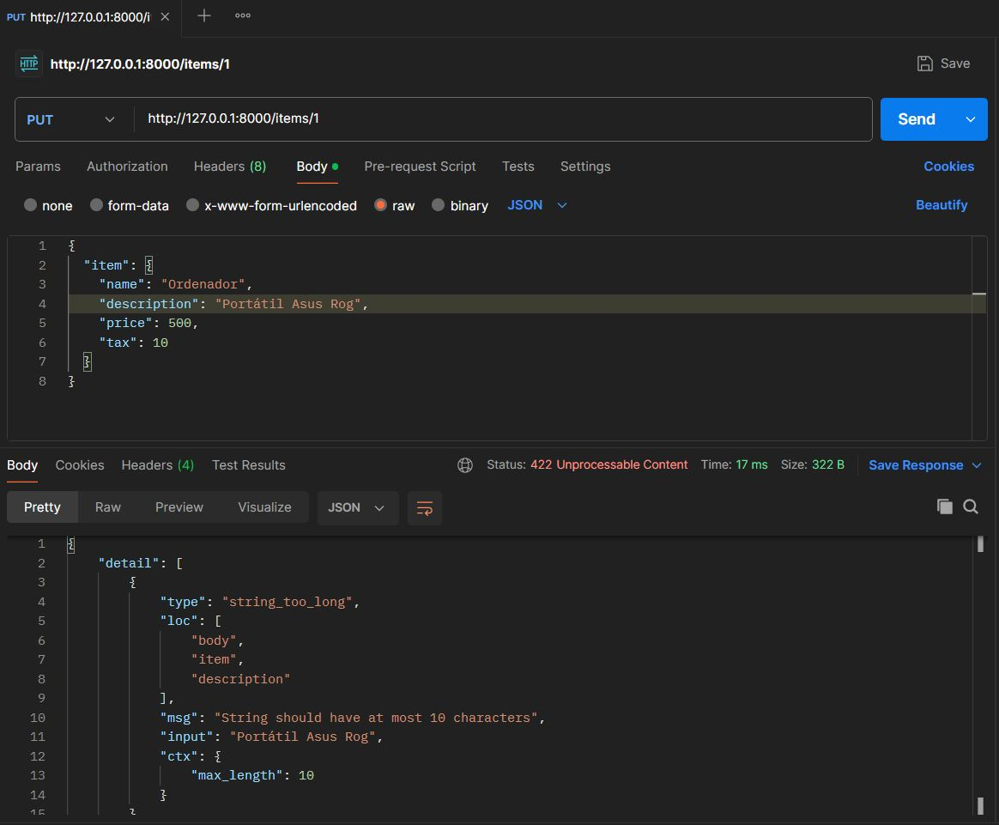
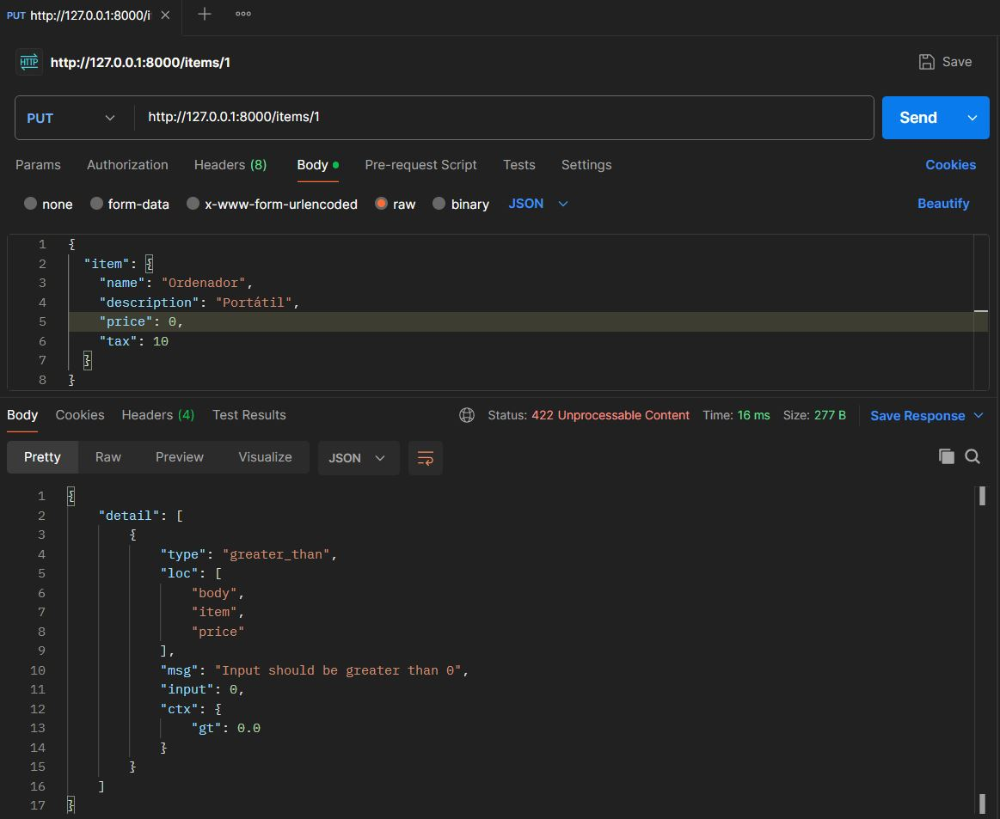
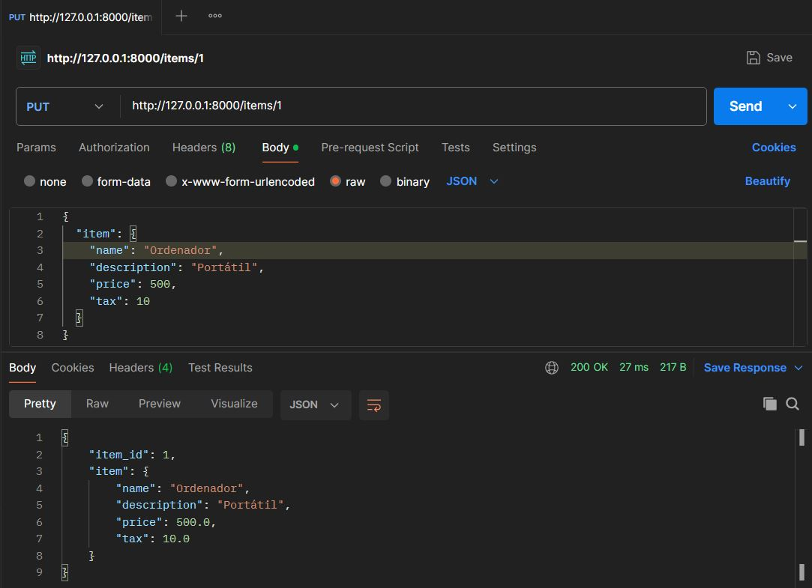
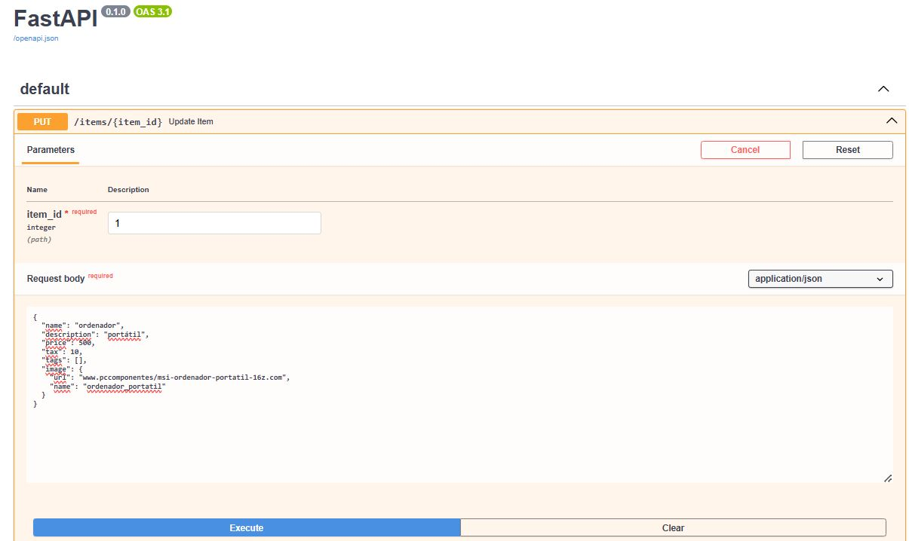
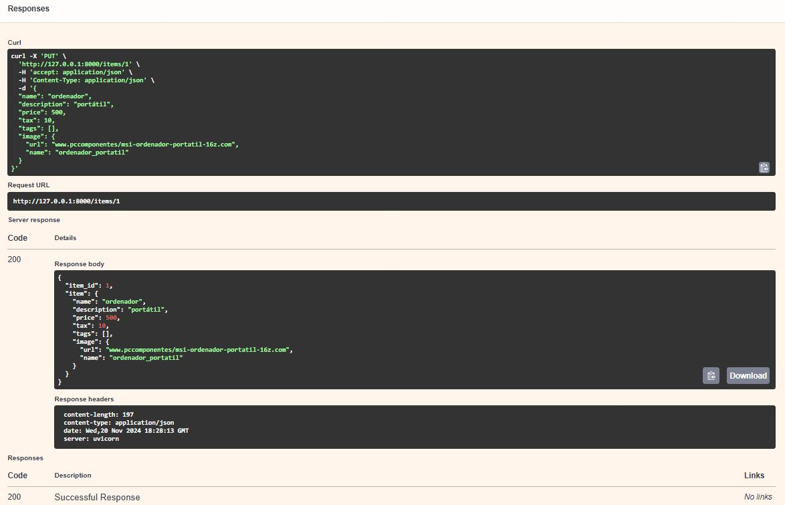

## POSTMAN - Body Fields

Se definen los atributos y las validaciones de un modelo.
Su funcionamiento consiste en que, a través de un item_id y un item (un objeto de tipo Item), valida los datos y devuelve un JSON como resultado.

En caos de que los parámetros de entrada sean incorrectos, daría error.

Case 1: Incorrecto porque superar el máximo número de carácteres que es 10 en la descricpción del item, y cómo consecuencia salta ése mensaje.

 

Case 2: Incorrecto por poner un número igual o inferior a 0 en el precio del item, ya que en el código tiene gt = 0, que significa gratter than = 0, es decir, que tiene que ser mayor a 0.

 

Case 3: Cuando introducimos los datos correctamente sin incumplir ninguna restricción, salta el código 200 conforme ha sido un éxito la petición.

## SWAGGER - Body Nested Models

Observamos que, a través de un modelo, se definen los tipos de cada parámetro, y mediante un submodelo podemos declarar objetos JSON con atributos, tipos y validaciones específicas.

La clase Image tiene 2 atributos: url y name.
La clase Item tiene sus propios atributos (name, description, price, etc.) y, por último, el atributo image, que es un objeto opcional de tipo Image.

De este modo, los modelos heredan de BaseModel, por lo que permite validar automáticamente los datos de entrada de forma específica según los atributos de cada modelo.

El funcionamiento de éste código consiste en pasar los parámetros item_id e item (un objeto de tipo Item), dónde crea un diccionario llamado results y devuelve un JSON como respuesta.

