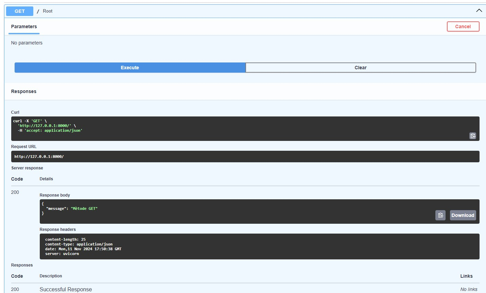

# UF2_FASTAPI

## GET - SWAGGER 

## GET - POSTMAN

## POST - SWAGGER 

 

## GET - SWAGGER - NO FUNCIONAL ERROR 400 RESPONSE

 

## GET - SWAGGER - NO FUNCIONAL ERROR 400 HTTPException

## GET - POSTMAN - NO FUNCIONAL ERROR 400 HTTPException

